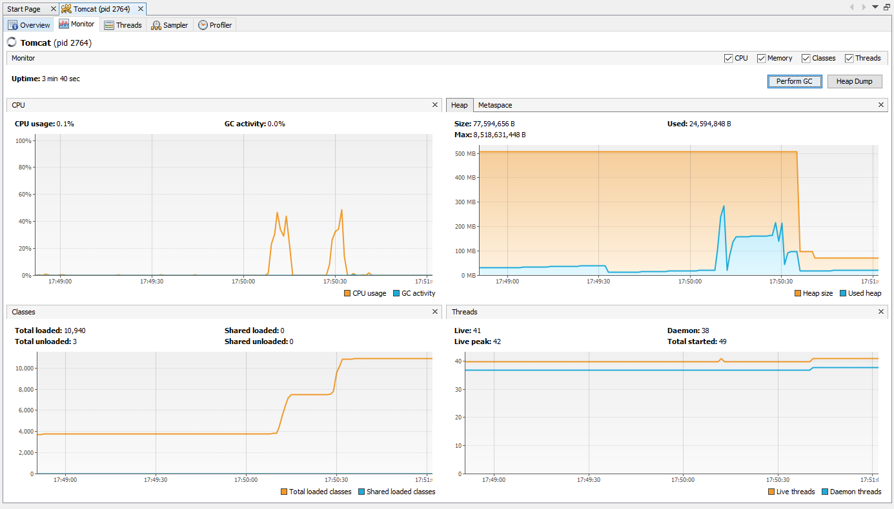
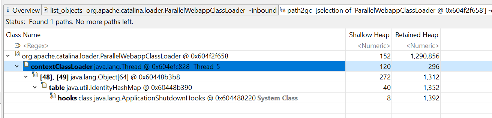
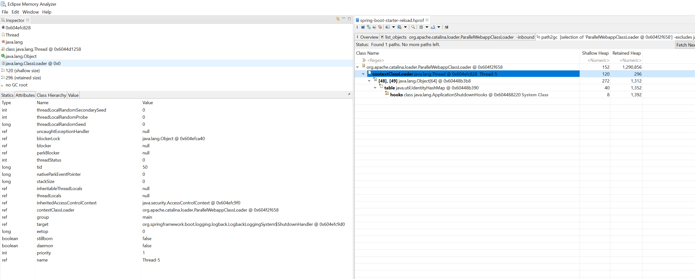
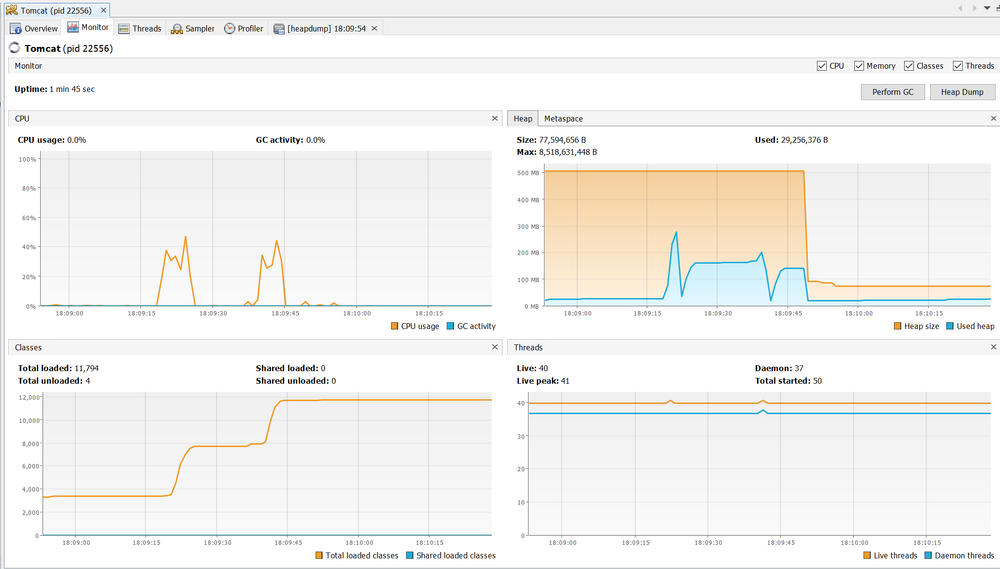
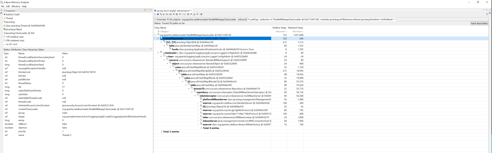

# spring-boot-starter.war

1. Startup `tomcat 9.0.27` using `AdoptOpenJDK\jdk-11.0.6.10-hotspot`
2. Deploy war
3. Reload war
4. Trigger Perform GC in Visual VM


Output of findleaks


```
The following web applications were stopped (reloaded, undeployed), but their
classes from previous runs are still loaded in memory, thus causing a memory
leak (use a profiler to confirm):
/spring-boot-starter
```





4. Take memory dump: spring-boot-starter-reload.hprof
5. Load dump in Eclipse Memory Analyzer


Eclipse memory analyzer:

1. List objexts with incoming references and filter to `**org.apache.catalina.loader.ParallelWebappClassLoader** `
   1. 5 found, expecting 4: the reloaded spring-boot-starter.war, the host-manager, manager and ROOT
2. One of the classloaders has a state of `DESTROYED`
3. For destroyed classloaded:
   1. Path to GC roots > Excluce all phatom/weak/soft/etc references 


A logback shutodwn hook appears to remain?








# spring-boot-starter.war

Repeat steps from above

Tomcat find leaks output:

```
The following web applications were stopped (reloaded, undeployed), but their
classes from previous runs are still loaded in memory, thus causing a memory
leak (use a profiler to confirm):
/spring-boot-complete-log4j2
```





EMA is similar story to with logback but the appears to be a Log4J2LoggingSystem shutdown hook this time. 




